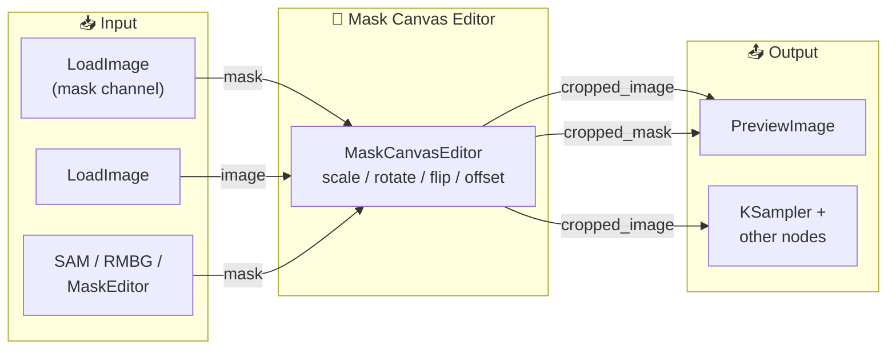

<p align="center">
  
  
  
</p>

<h1 align="center">🎨 ComfyUI Mask Canvas Editor</h1>

<p align="center">
  <b>English</b> &nbsp;|&nbsp; <a href="#中文说明">中文说明</a>
</p>

<p align="center">
  <i>Interactive canvas-like visual editor for positioning images behind mask regions in ComfyUI.</i>
</p>

---

## Overview

**Mask Canvas Editor** is a **fully graphical** ComfyUI custom node — the node body **IS** the interactive canvas editor. There are no parameter sliders or text widgets to tweak. The mask acts as a fixed "window" at the center of the node, and you directly **drag**, **scroll**, and **click** on the node body to position the background image behind it. The node outputs the image content exactly as seen through the mask.

Think of it as cropping an image to a mask, but controlled entirely through visual canvas interaction — just like Photoshop's canvas tool.

### ✨ Key Features

- 🎨 **Node IS the Editor** — No slider widgets, no popup modals. The node body itself is the interactive canvas
- 🖼️ **Mask as Window** — The mask stays centered; the background image moves behind it
- 🔄 **Full Transform Control** — Scale (0.01×–10×), rotation (±180°), horizontal/vertical flip, pixel-precise offset
- 🖱️ **Direct Manipulation** — Drag to pan, scroll to zoom, Shift+scroll to rotate, buttons to flip
- 🎯 **Grid Overlay** — Checkerboard pattern with center crosshair shows the background image bounds and transforms
- 📦 **Zero Dependencies** — Works with ComfyUI's built-in torch; no extra packages required
- 🌐 **Bilingual** — Supports both English and Chinese workflows

---

## Installation

### Via ComfyUI Manager (Recommended)

Search for `Mask Canvas Editor` in ComfyUI Manager and click install.

### Manual Installation

```bash
cd ComfyUI/custom_nodes/
git clone https://github.com/ku1x/ComfyUI-MaskCanvasEditor.git
```

No extra dependencies — just restart ComfyUI.

---

## Usage

### Quick Start

1. Add **Mask Canvas Editor** from the node menu: `Mask/CanvasEditor > Mask Canvas Editor`
2. Connect a **MASK** and an **IMAGE** to the node inputs
3. The node body becomes an interactive canvas — **interact directly with it**:
   - 🖱️ **Drag** on the node body to pan the background image
   - 🖱️ **Scroll** on the node body to zoom in/out
   - 🖱️ **Shift+Scroll** on the node body to rotate
   - 🔘 Click **↔ H** / **↕ V** buttons in the bottom toolbar to flip
   - 🔘 Click **↺ R** in the toolbar to reset
4. Queue the workflow — the node outputs the **cropped image** and **cropped mask** at the mask's bounding-box size

> No parameter sliders. No modal dialogs. The node is the tool.

### Node Inputs

The node has **only 2 inputs** — no parameter widgets to configure:

| Input | Type | Description |
|-------|------|-------------|
| `mask` | MASK | Mask defining the crop window |
| `image` | IMAGE | Background image to position |

All transformation parameters (scale, rotation, flip, offset) are controlled **entirely through visual interaction** on the node body.

### Node Outputs

| Output | Type | Description |
|--------|------|-------------|
| `cropped_image` | IMAGE | Transformed image cropped to the mask's bounding box |
| `cropped_mask` | MASK | Mask cropped to its own bounding box |

### Example Workflow



---

## How It Works

The node computes the bounding box of the mask, then builds a **reverse sampling grid** — for every output pixel, it calculates where in the source image that pixel should come from after applying the inverse of all user transforms (pan → rotate → scale → flip). This grid is passed to `torch.nn.functional.grid_sample` for efficient GPU-accelerated sampling.

```
Output pixel → (inverse offset) → (inverse rotate) → (inverse scale) → (inverse flip) → Source pixel
```

The JavaScript frontend renders the same transform chain visually on the node body as an interactive canvas, giving you real-time feedback as you drag, scroll, and click directly on the node.

---

## Project Structure

```
ComfyUI-MaskCanvasEditor/
├── __init__.py                           # Extension entry point
├── py/
│   └── nodes/
│       └── mask_canvas_editor.py         # Python backend node
├── js/
│   └── mask_canvas_editor.js             # JavaScript interactive editor
├── requirements.txt
├── LICENSE
└── README.md
```

---

## Compatibility

- **ComfyUI**: All recent versions
- **Python**: 3.8+
- **Dependencies**: None (uses ComfyUI's built-in PyTorch)

---

## License

MIT License — see [LICENSE](LICENSE) for details.

---

<p align="center">
  If you find this useful, please ⭐ star the repo!
</p>

---

<h2 id="中文说明" align="center">🎨 ComfyUI Mask Canvas Editor</h2>

<p align="center">
  <i>交互式画布可视化编辑器 — 在 ComfyUI 中像 Canvas 一样定位遮罩背后的图片。</i>
</p>

---

## 概述

**Mask Canvas Editor** 是一个**完全图形化**的 ComfyUI 自定义节点——节点体本身就是交互式画布编辑器，没有参数滑块或文字控件。遮罩固定在节点中央作为一个"窗口"，你可以直接在节点体上**拖拽、滚动、点击**来定位背后的背景图片，节点会输出遮罩窗口范围内对应看到的内容。

简单来说就是：用遮罩裁剪图片，但是通过在节点上直接进行可视化交互来控制图片位置——就像 Photoshop 的画布工具一样。

### ✨ 核心功能

- 🎨 **节点即编辑器** — 没有参数滑块，没有模态弹窗。节点体本身就是交互式画布
- 🖼️ **遮罩即窗口** — 遮罩固定在画面中央，背景图在其背后移动
- 🔄 **完整变换控制** — 缩放（0.01×–10×）、旋转（±180°）、水平/垂直翻转、像素级偏移
- 🖱️ **直接操控** — 拖拽平移、滚轮缩放、Shift+滚轮旋转、按钮翻转
- 🎯 **网格覆盖层** — 棋盘格 + 中心十字线直观展示背景图片的边界与变换状态
- 📦 **零依赖** — 利用 ComfyUI 内置的 PyTorch，无需额外安装
- 🌐 **双语支持** — 同时支持中英文工作流

---

## 安装

### 通过 ComfyUI Manager（推荐）

在 ComfyUI Manager 中搜索 `Mask Canvas Editor` 并安装。

### 手动安装

```bash
cd ComfyUI/custom_nodes/
git clone https://github.com/ku1x/ComfyUI-MaskCanvasEditor.git
```

无需额外依赖，重启 ComfyUI 即可。

---

## 使用方法

### 快速上手

1. 从节点菜单添加节点：`Mask/CanvasEditor > Mask Canvas Editor`
2. 将 **MASK** 和 **IMAGE** 连接到节点输入
3. 节点体变成交互式画布——**直接在节点上操作**：
   - 🖱️ **拖拽**节点体来平移背景图片
   - 🖱️ **滚轮**在节点体上缩放
   - 🖱️ **Shift+滚轮**在节点体上旋转
   - 🔘 点击底部工具栏的 **↔ H** / **↕ V** 按钮翻转
   - 🔘 点击底部工具栏的 **↺ R** 重置
4. 加入队列——节点输出裁剪至遮罩边界框大小的**图片**和**遮罩**

> 没有参数滑块。没有模态弹窗。节点本身就是工具。

### 节点输入

节点**仅有 2 个输入**——没有任何参数控件：

| 输入 | 类型 | 说明 |
|-------|------|-------------|
| `mask` | MASK | 定义裁剪窗口的遮罩 |
| `image` | IMAGE | 需要定位的背景图片 |

所有变换参数（缩放、旋转、翻转、偏移）完全通过节点体上的**可视化交互**控制。 |

### 节点输出

| 输出 | 类型 | 说明 |
|--------|------|-------------|
| `cropped_image` | IMAGE | 变换后的图片，裁剪至遮罩边界框 |
| `cropped_mask` | MASK | 裁剪至其自身边界框的遮罩 |

---

## 工作原理

节点首先计算遮罩的边界框（bounding box），然后构建一个**反向采样网格**——对于输出图像的每个像素，逆向计算在源图像中应该从哪里采样（逆平移 → 逆旋转 → 逆缩放 → 逆翻转）。该网格传递给 `torch.nn.functional.grid_sample` 进行高效的 GPU 加速采样。

```
输出像素 → (逆偏移) → (逆旋转) → (逆缩放) → (逆翻转) → 源图像像素
```

JavaScript 前端在 HTML5 Canvas 上实时渲染相同的变换链，让你在调整参数时获得即时视觉反馈。

---

## 兼容性

- **ComfyUI**: 所有近期版本
- **Python**: 3.8+
- **额外依赖**: 无（使用 ComfyUI 内置的 PyTorch）

---

## 开源协议

MIT License — 详见 [LICENSE](LICENSE) 文件。

---

<p align="center">
  如果这个项目对你有帮助，请 ⭐ Star 支持！
</p>
